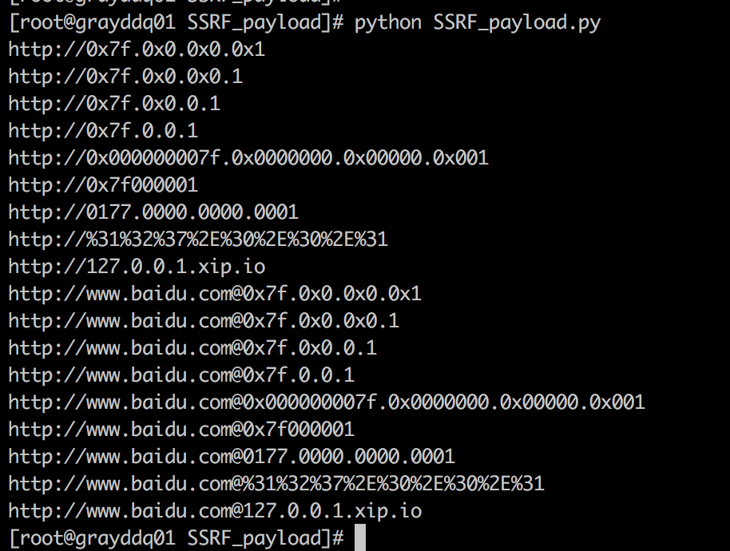

# SSR_payload 0.1

本脚本旨在生成各类畸形绕过ssrf限制的ip扫描payload

## Author ##

咚咚呛 、D4Vinci

部分代码参考了作者D4Vinci的代码，感谢作者无私的奉献

如有其他建议，可联系微信280495355

## Test Environment ##

>centos 7
>
>python 2.7

## Tree ##

	SSRF_payload
	----SSRF_payload.py		   	   #程序主程序

## Deploy ##
	
	脚本放置在任意目录中
	1）$ python SRF_payload.py 尝试运行并生成关于127.0.0.1的payload

## Config ##

配置参数：SSRF_payload.py

	# 修改扫描或访问的ip地址
	ip = '127.0.0.1'
	# 添加访问的域名白名单，通常会用于绕过服务端域名白名单的限制
	domain = 'www.baidu.com'

## Screenshot ##

